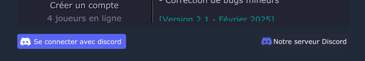
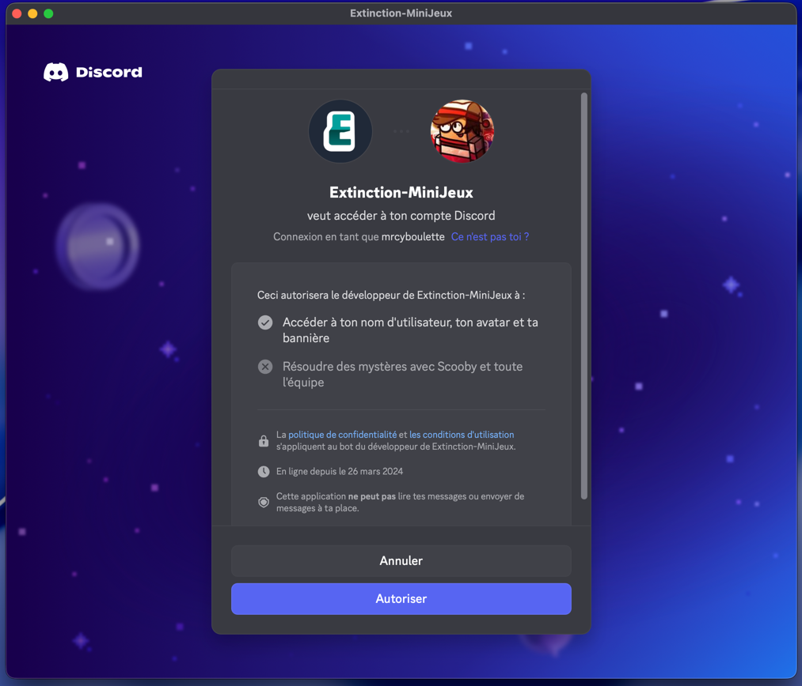
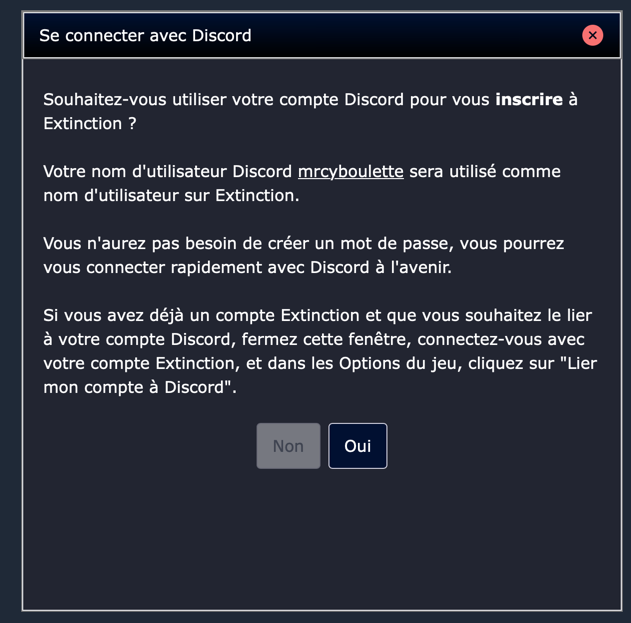
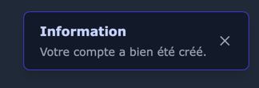
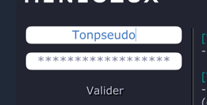
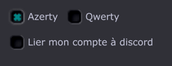
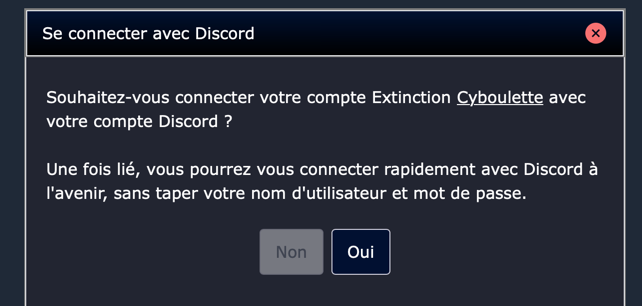
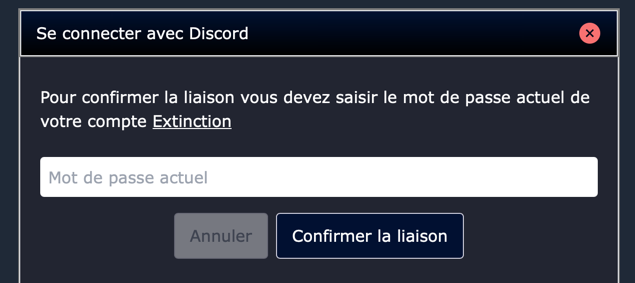
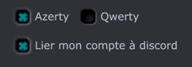

import { Steps } from '@astrojs/starlight/components';

Il est désormais possible de s'inscrire ou de se connecter automatiquement avec Discord

Si tu souhaites profiter de cette fonctionnalité, il te suffit de cliquer sur le bouton "Se connecter avec Discord",
si tu passes par l'activité Discord pour lancer le jeu, ce sera fait automatiquement

## Autoriser l'accès à tes informations Discord

<Steps>
1. Clique sur le bouton "Se connecter avec Discord"
2. Une fenêtre Discord s'ouvre, connecte-toi si nécessaire
3. Vérifie les informations demandées (nom d'utilisateur, avatar, adresse e-mail)
4. Clique sur "Autoriser" pour valider
    
    *Note: seules les informations basiques sont demandées, ton mot de passe Discord n'est jamais requis, nous récupérons uniquement ton pseudo, ton identifiant unique (ID) et ton avatar*
</Steps>

## Inscription avec Discord

Si ton compte Discord ne correspond à aucun compte existant sur le jeu, une inscription te sera proposée

Confirme les informations, puis valide l'inscription

🎉 Félicitations, tu es maintenant inscrit et connecté avec Discord ! Tu n'as plus besoin de retenir un mot de passe supplémentaire et tu peux profiter de la re-connexion automatique

## Connexion avec Discord

Utilise le bouton "Se connecter avec Discord" sur la page de connexion, puis autorise l'accès aux informations de ton compte Discord si nécessaire

Si ton compte Discord est déjà lié à un compte existant, tu seras automatiquement connecté, sinon une inscription te sera proposée, lors de ta prochaine visite tu seras reconnecté automatiquement

## Lier ton compte existant

Si tu possèdes déjà un compte sur Extinction-MiniJeux, tu peux le lier à ton compte Discord

<Steps>
1. Ignore l'inscription proposée après avoir cliqué sur "Se connecter avec Discord"
2. Connecte-toi normalement avec ton pseudo et mot de passe
    
3. Rends-toi dans les options du jeu et clique sur "Lier avec Discord"
    
4. [Autorise l'accès aux informations basiques](#autoriser-laccès-à-tes-informations-discord) de ton compte Discord
5. Confirme la liaison
    
6. Saisi ton mot de passe Extinction pour valider la liaison
    
</Steps>

🎉 Félicitations, ton compte est maintenant lié à Discord ! Plus besoin de mot de passe pour tes prochaines connexions

*Note: tu ne peux lier qu'un seul compte Extinction à ton compte Discord*

Tu peux à tout moment délier tes comptes, en décochant la case dans les options

## Informations supplémentaires

- Si tu passes par l'activité Discord pour lancer le jeu, il te sera proposé automatiquement soit une inscription soit une connexion.
Si tu n'as pas encore lié ton compte Extinction à ton compte Discord, ferme la popup et connecte-toi normalement, puis suis les étapes pour lier ton compte existant

- Lors de l'inscription, ton pseudo Discord sera utilisé comme pseudo de jeu par défaut.
Les caractères interdits sur le jeu seront automatiquement retirés et tu ne pourras pas te renommer ensuite

- Si ton pseudo Discord correspond à un pseudo existant et que celui-ci n'est pas lié à ton compte Discord, il te sera proposé de lier le compte (tu devras en confirmer le mot de passe)

## Support

Si tu rencontres des problèmes lors de la connexion avec Discord, n'hésite pas à rejoindre notre serveur Discord et à demander de l'aide dans le canal [#support-technique](https://discord.com/channels/622231984965681153/1468691697146794056)
