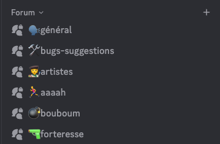
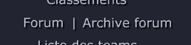

Notre [serveur Discord](https://discord.gg/2Ebe5C7czE) devient la place centrale pour les échanges de la communauté

## Rejoindre le forum Discord

Clique sur le bouton "Forum" en jeu, ou retrouve le forum directement sur le serveur Discord dans la catégorie Forum

### Archive du forum

Tu peux toujours consulter les anciennes disucssions depuis le jeu, mais tout est en lecture seule :

## Pourquoi migrer vers Discord ?

Nous avons choisi de migrer notre forum vers Discord pour plusieurs raisons :

- **Centralisation de la communauté** : Discord est déjà le lieu de rassemblement de notre communauté, avec des salons de discussion, des événements et des annonces. Intégrer le forum directement sur Discord permet de centraliser les échanges et de faciliter la participation
- **Accessibilité** : Discord est accessible sur de nombreuses plateformes (PC, mobile, web) et offre une expérience utilisateur fluide. Cela permet à tous les joueurs de participer au forum facilement, sans avoir à naviguer vers un site externe
- **Fonctionnalités améliorées** : Discord offre des fonctionnalités de modération, de gestion des rôles et de personnalisation qui permettent de créer une expérience de forum plus dynamique et interactive. Nous pouvons organiser les discussions par sujet, mettre en avant les contributions de la communauté et pourquoi pas offrir des récompenses exclusives aux membres les plus actifs

### Migration des discussions

Nous avons fait le choix de repartir d'une page blanche tout en conservant l'archive du forum précédent accessible en lecture seule. Cela nous permet de repartir sur de bonnes bases, d'organiser les discussions de manière plus claire et de favoriser les échanges entre les membres de la communauté

Certaines discussions importantes ont été migrées manuellement

Le forum "Team" n'a pas été migré sur Discord, on part du principe que vous pouvez créer votre propre group privé, ou nous demander à créer un salon privé pour votre équipe si besoin
