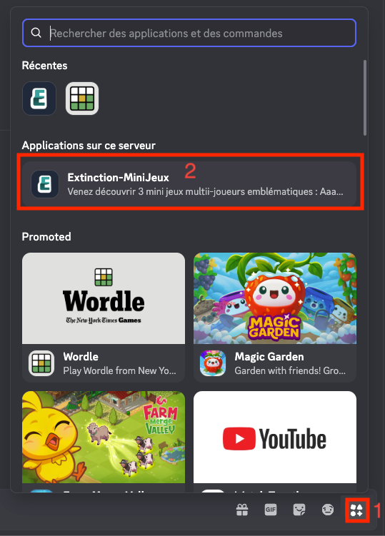
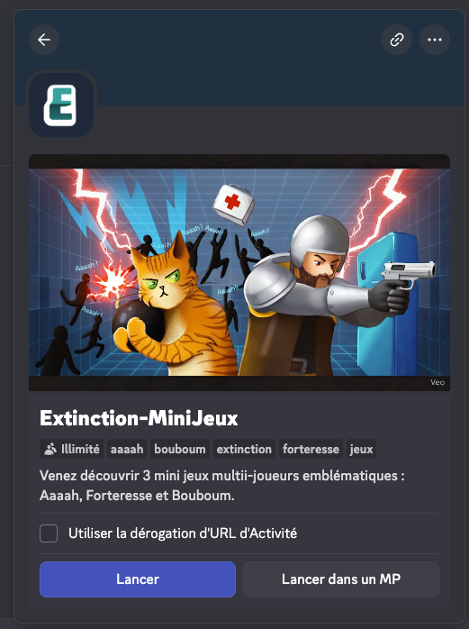

import { Steps } from '@astrojs/starlight/components';

Si tu ne souhaites pas jouer via ton navigateur ou via l'application de bureau, tu peux également jouer à Extinction-MiniJeux directement depuis Discord. Voici comment faire :

## Jouer depuis les activités Discord

Clique [ici](https://discord.com/activities/1222168423585284198) pour accéder directement à l'activité Discord.

## Jouer depuis le serveur officiel

<Steps>
1. Ouvre l'application Discord sur ton ordinateur
2. Si tu es membre du serveur Discord d'Extinction-MiniJeux, rends-toi dans le canal [#🎮-play](https://discord.com/channels/622231984965681153/1419328398962065599)
3. En bas à droite, accède aux activités disponibles
4. Clique sur "Extinction-MiniJeux"
    
5. Clique sur "Lancer"
    
</Steps>

🎉 Félicitations, tu joues maintenant à Extinction-MiniJeux via Discord ! Tu peux profiter de toutes les fonctionnalités du jeu tout en restant connecté avec tes amis sur Discord.

Si tu souhaites lier à la fois ton compte Discord et ton compte Extinction-MiniJeux, tu peux suivre les étapes de [liaison de compte](./login.mdx#lier-ton-compte-existant) pour profiter d'une expérience encore plus personnalisée.

*Note : que tu joues via Discord, via navigateur ou via la version exécutable, c'est désormais le même jeu.*
