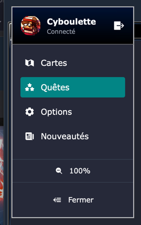
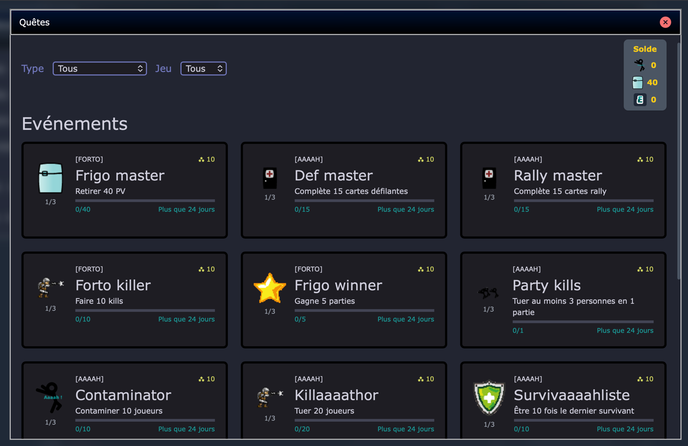

import { Steps } from '@astrojs/starlight/components';

Nous proposons un système de quêtes événementielles ou globales qui te permettent de gagner des points et de débloquer des récompenses exclusives.
Que tu sois un joueur occasionnel ou un compétiteur acharné, il y a des quêtes pour tous les niveaux et tous les styles de jeu.

*Note : le système étant récent, les quêtes disponibles sont limitées, sujettes à changement et les récompenses arriveront progressivement.*

## Comment ça marche ?

<Steps>
1. Dans le menu principal, clique sur l'onglet "Quêtes"
    
2. Parcours les différentes quêtes disponibles et regarde les objectifs et les récompenses associées
    
    Tu n'as pas besoin de t'inscrire ou d'activer une quête, il te suffit de remplir les objectifs pour gagner les récompenses.
3. Pour chaque quête, tu peux connaître ta progression, ce qu'il te reste à faire et ton palier actuel
    
</Steps>

*Note : Les quêtes "événements" sont réinitialisées tous les mois.*

## Récompenses

En complétant des quêtes, tu gagnes des points qui te permettent de débloquer des récompenses exclusives.

Chaque quête "événement" te donne un nombre de points lié au jeu auquel elle est associée. Par exemple, une quête liée au jeu "Aaaah" te donnera des points "Aaaah".

Tu peux retrouver à tout moment ton solde actuel de points sur l'écran principal des quêtes.

Les récompenses sont en cours de développement et seront annoncées prochainement.
