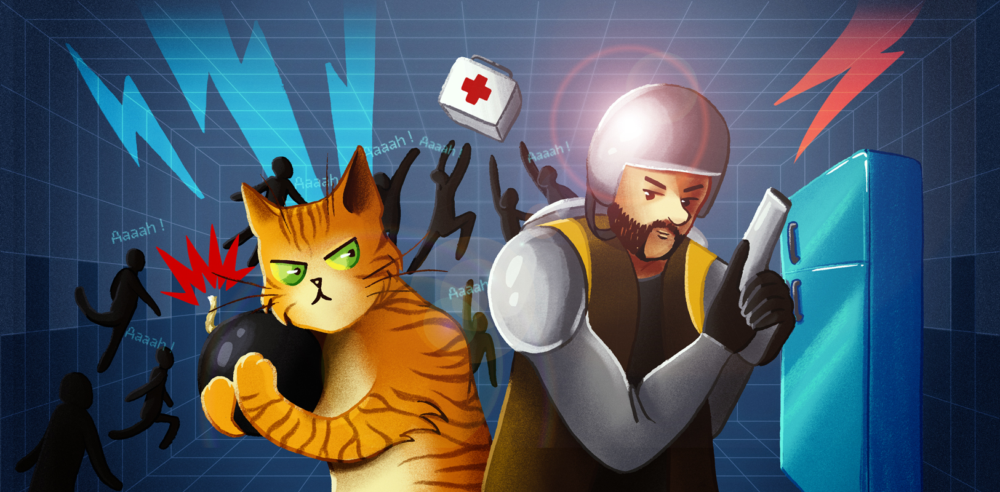

- Nouvelle bannière et nouveau logo
  - Un nouveau logo plus moderne et épuré, inspiré de l'ancien mais avec une touche de fraîcheur
  - Une nouvelle bannière pour accompagner le lancement de la nouvelle version du jeu
- Plus besoin de Flash pour pouvoir jouer au jeu
  - Joue directement depuis ton navigateur, le nouvel exécutable ou Discord
    - Expérience unifiée, un seul et même client pour tout le monde, que tu joues sur navigateur, Discord ou l'exécutable
- Interface enrichie
  - Recherche avancée des cartes pour Aaaah et Forteresse
  - Système de playlist personnalisée à la volée
- Système de quêtes
  - Accomplis des quêtes pour gagner des récompenses (les récompenses arriveront progressivement)
- Intégration avec Discord
  - Connexion, inscription et liaison de compte avec Discord
  - Lancement du jeu directement depuis Discord
- Forum de la communauté
  - Le forum accessible depuis le jeu passe en lecture seule
  - Le nouveau forum est directement accessible et intégré à notre [serveur Discord](https://discord.gg/2Ebe5C7czE)
